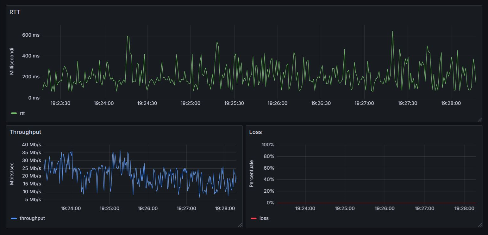

# MonitoraggioServer

Sistema containerizzato tramite Docker per il monitoraggio di server iperf tramite oggetti LwM2M modellati con Leshan. L’obiettivo è rappresentare un Digital Twin del server, capace di misurare metriche di rete come RTT, Throughput e Packet Loss in modo automatizzato.

---

## Funzionalità principali

- Utilizzo di **Leshan** per la gestione dei dispositivi tramite protocollo **LwM2M (Lightweight M2M)**
- Integrazione con **iperf** come server per il monitoraggio delle prestazioni di rete
- Containerizzazione con **Docker** per ambienti isolati e facilmente riproducibili

---

## Requisiti

- Linux
- OpenJDK17
- Maven
- Docker

---

## Setup

### 1. Installazione requisiti

Installazione Docker
> https://docs.docker.com/engine/install/

Installazione OpenJDK17
```bash
wget https://download.oracle.com/java/17/archive/jdk-17.0.12_linux-x64_bin.tar.gz
tar -xvf jdk-17_linux-x64_bin.tar.gz
sudo mkdir -p /usr/local/java
sudo mv jdk-17* /usr/local/java/jdk-17
echo "export JAVA_HOME=/usr/local/java/jdk-17" >> ~/.bashrc
echo "export PATH=\$JAVA_HOME/bin:\$PATH" >> ~/.bashrc
source ~/.bashrc
```

Selezione della versione 17
```bash
sudo update-alternatives --config java
```

Installazione Maven
```bash
sudo apt install maven
```

### 2. Clonazione repository ed esecuzione script di installazione:

```bash
git clone https://github.com/sasopenna/MonitoraggioServer.git
cd MonitoraggioServer
sudo bash install.sh
```

### 3. Esecuzione monitoraggio 

```bash
sudo bash run.sh
```

### 4. Verifica monitoraggio su Grafana

Collegarsi su `http://localhost:3000/dashboard` per visualizzare i dati raccolti



---

## Crediti

Progetto sviluppato da **Salvatore Penna** come parte integrante dell'esame _IoT & 5G_.